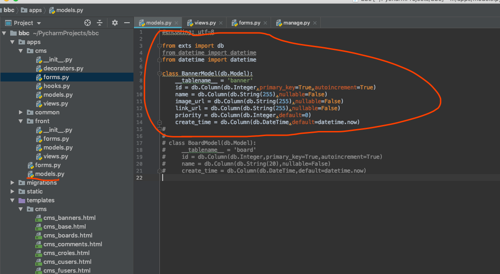
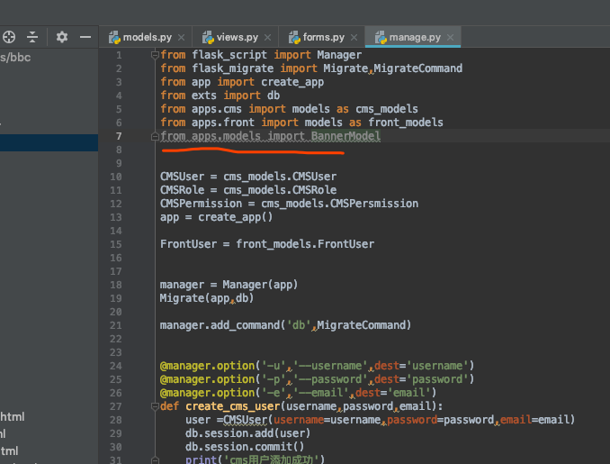
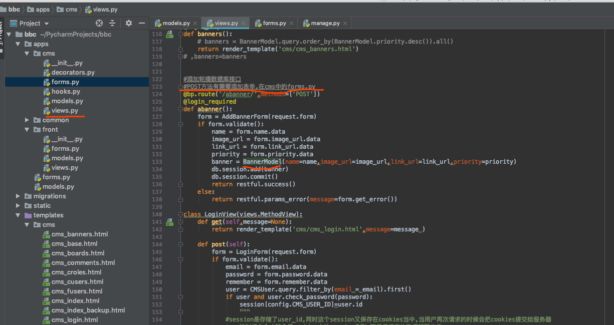
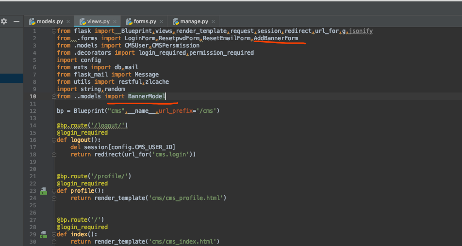
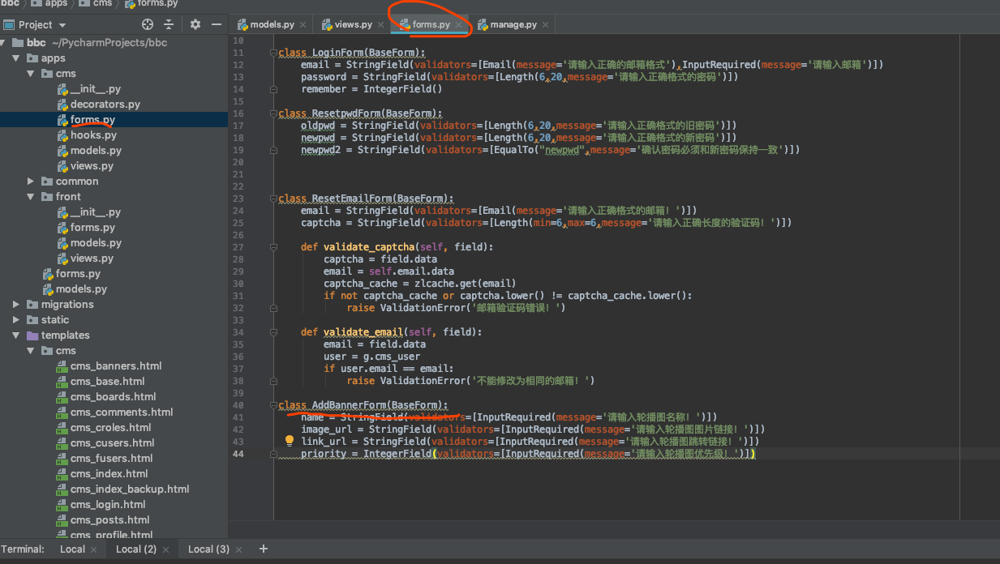

[TOC]
## 添加流程:





```

(my_env) $python3 manage.py db migrate
INFO [alembic.runtime.migration] Context impl MySQLImpl.
INFO [alembic.runtime.migration] Will assume non-transactional DDL.
INFO [alembic.autogenerate.compare] Detected added column 'banner.create_time'
  Generating /Users/mac/PycharmProjects/bbc/migrations/versions/f9d6a44c9f5d_.py
  ... done
(my_env) $python3 manage.py db upgrade
INFO [alembic.runtime.migration] Context impl MySQLImpl.
INFO [alembic.runtime.migration] Will assume non-transactional DDL.
INFO [alembic.runtime.migration] Running upgrade bcd1ceec0210 -> f9d6a44c9f5d, empty message


mysql> show tables;
+-----------------+
| Tables_in_zlbbs |
+-----------------+
| alembic_version |
| banner |
| cms_role |
| cms_role_user |
| cms_user |
| front_user |
+-----------------+
6 rows in set (0.00 sec)

```

添加后端代码,这里为post方法需要添加表单




